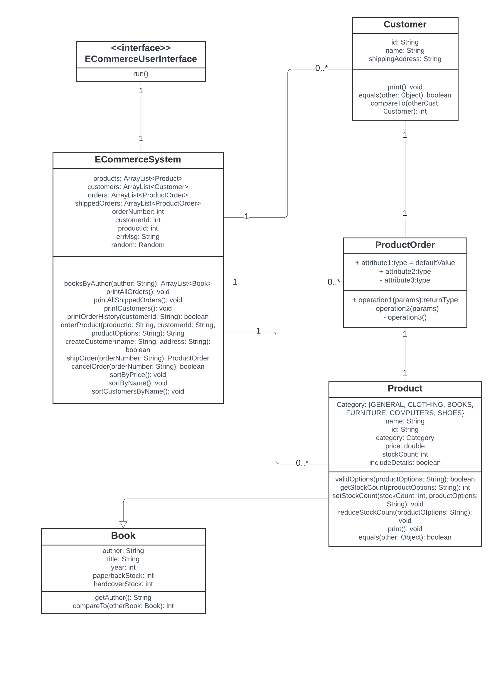

# ECommerceSystem Administrator CLI

This command line application allows you to simulate being the administrator of an `ECommerceSystem`.

## Available Commands

- `prods`: View all the products offered by the ECommerce System.
- `books`: View all the products that are categorized as 'literature'.
- `custs`: View all the customers registered into the ECommerceSystem.
- `sortbyprice`: Sort and display all the products in the inventory by ascending price.
- `sortbyname`: Sort and display all the products in the inventory by alphabetical order of names.
- `sortcusts`: Sort and display customers by alphabetical order of first name.
- `booksbyauthor`: View all books written by a certain author.
- `orders`: View all unshipped orders.
- `shipped`: View all shipped orders.
- `order`: Create a new (currently unshipped) order.
- `orderbook`: Create a new order for a book.
- `ship`: Force the immediate shipping of an order.
- `custorders`: View all the current and past (already shipped) orders of a particular customer.
- `newcust`: Register a new customer into the ECommerceSystem.
- `cancel`: Cancel a new and unshipped order.

##Installation and Running
1. **Clone the Repository**: 'git clone https://github.com/tinyHiker/java_ecommerce_system.git'
2. **Navigate to the Project Directory**: 'cd java_ecommerce_system'
3. **Compile the Java Files**: Make sure you have the Java Development Kit (JDK) installed. Compile the Java files using: 'javac -d bin src/*.java'. This command compiles the Java source files and places the resulting `.class` files in a `bin/` directory.
4. **Run the Application**:
`ECommerceUserInterface` has the main method: 'java -cp bin ECommerceUserInterface'

